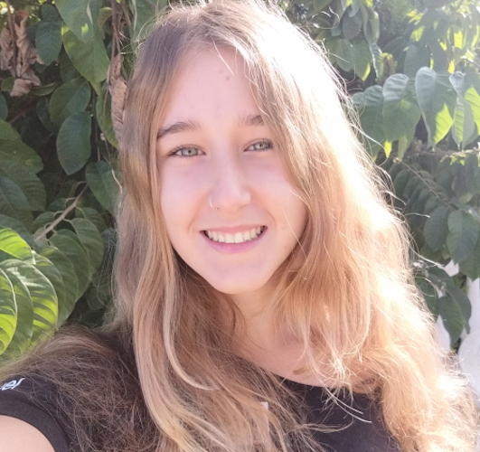

# El Equipo

    

## Sobre el equipo

### **Estefanía García Gallardo**

Desarrolladora full stack de Málaga, speaker internacional, organizadora de AngularMálaga y GDGMálaga, co-creadora del proyecto [Npkill](https://npkill.js.org/) y amante del Open Source & código limpio. Le encanta escribir sobre tecnología y arreglar bugs a las 2 de la mañana.&#x20;

Creadora de contenido en [DotTech](https://www.youtube.com/c/DotTechES).&#x20;

**Redes sociales:**

* [Github](https://github.com/nyagarcia)&#x20;
* [Twitter](https://twitter.com/nyablk)
* [Youtube](https://www.youtube.com/c/DotTechES)

### **Lucy Gallardo Villena**

Sure Contable. Especialista en analizar las necesidades reales de los diferentes departamentos para generar informes de análisis. Amante de la buena redacción y editora jefe de [DotTech](https://medium.com/dottech). Encantada de ayudar a las nuevas generaciones para conseguir estos fines**.**

**Redes sociales:**

* [Github](https://github.com/lucy6767)
* [Twitter](https://twitter.com/lucy6767)

### **Carlos Caballero González**

Ingeniero y Doctor en Informática por la Universidad de Málaga.

Es profesor colaborador en la UOC y la Junta de Andalucía en la familia profesional de Informática y Telecomunicaciones. Ha escrito varios libros docentes y más de una decena de artículos de investigación en inteligencia artificial y física solar.

Amante de la Ingeniería Informática que trata de transmitir este amor por esta ciencia cada día desde las escuelas.

Creador de contenido en DotTech.&#x20;

**Redes sociales:**

* [Github](https://github.com/caballerog)
* [Twitter](https://twitter.com/carlillo)
* [Youtube](https://www.youtube.com/c/DotTechES)

### **Juan Torres Gómez**

Amante del Open Source, la WEB, pizza y resolver problemas :D

Making stuff, all the time 🔥

* Full Stack 🌌
* Sysadmin 💻
* Desarrollador de videojuegos 👾
* Creador 🔩

**Redes sociales:**

* [Github](https://github.com/zaldih)
* [Twitter](https://twitter.com/juaniman99)

### **Toni Villena Jiménez**

Técnico Superior en Desarrollo de Aplicaciones Web.Actualmente en el camino de ser Ingeniero del Software, ha desarrollado software desde hace más de 5 años aportando a la comunidad con módulos para Angular o Go, aunque no está atado a ninguna tecnología.

**Redes sociales:**

* [Github](https://github.com/tonivj5)
* [Twitter](https://twitter.com/tonivj5)
